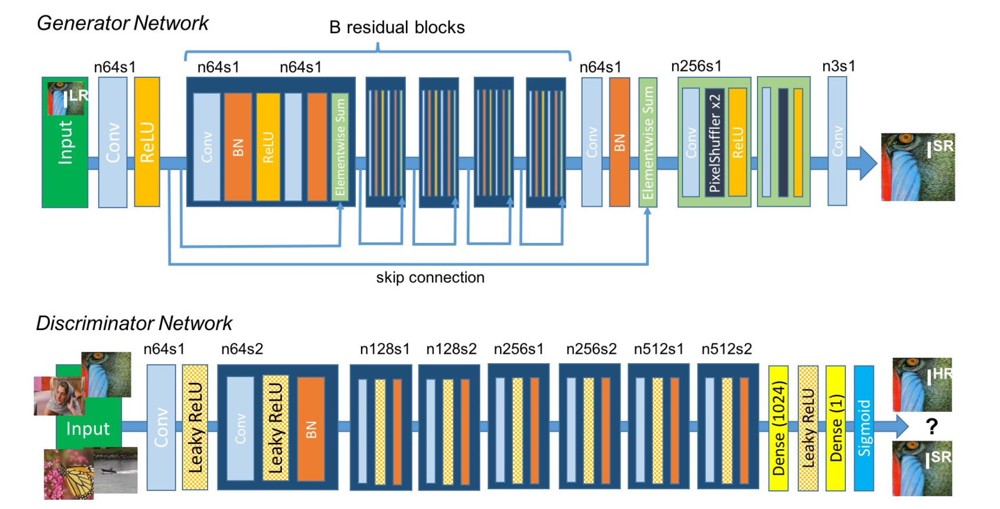
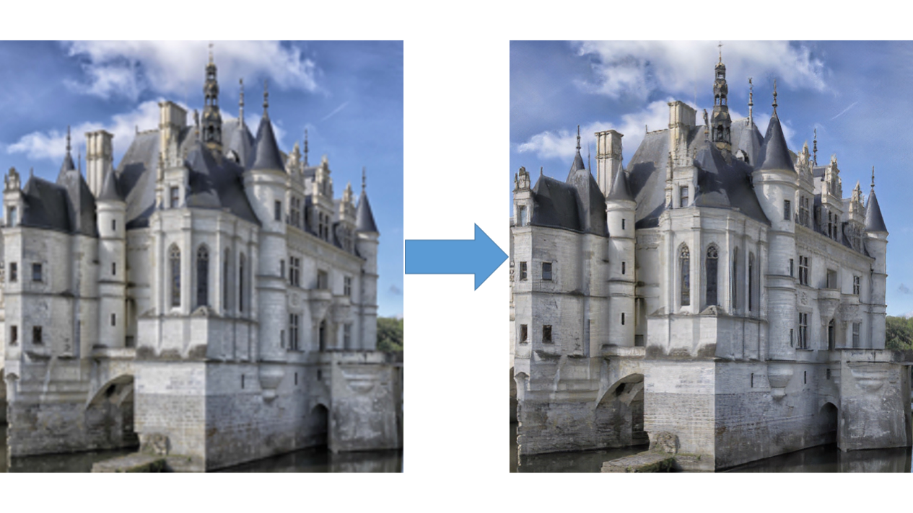

## Super Resolution Examples

- Implementation of ["Photo-Realistic Single Image Super-Resolution Using a Generative Adversarial Network"](https://arxiv.org/abs/1609.04802)

- For earlier version, please check [srgan release](https://github.com/tensorlayer/srgan/releases) and [tensorlayer](https://github.com/tensorlayer/TensorLayer).

- For more computer vision applications, check [TLXCV](https://github.com/tensorlayer/TLXCV)


### SRGAN Architecture


<a href="https://github.com/tensorlayer/TensorLayerX">
<div align="center">
	
</div>
</a>
<a href="https://github.com/tensorlayer/TensorLayerX">
<div align="center">
	
</div>
</a>

### Prepare Data and Pre-trained VGG

- 1. You need to download the pretrained VGG19 model weights in [here](https://drive.google.com/file/d/1CLw6Cn3yNI1N15HyX99_Zy9QnDcgP3q7/view?usp=sharing).
- 2. You need to have the high resolution images for training.
  -  In this experiment, I used images from [DIV2K - bicubic downscaling x4 competition](http://www.vision.ee.ethz.ch/ntire17/), so the hyper-paremeters in `config.py` (like number of epochs) are seleted basic on that dataset, if you change a larger dataset you can reduce the number of epochs. 
  -  If you dont want to use DIV2K dataset, you can also use [Yahoo MirFlickr25k](http://press.liacs.nl/mirflickr/mirdownload.html), just simply download it using `train_hr_imgs = tl.files.load_flickr25k_dataset(tag=None)` in `main.py`. 
  -  If you want to use your own images, you can set the path to your image folder via `config.TRAIN.hr_img_path` in `config.py`.


### Run

🔥🔥🔥🔥🔥🔥 You need install [TensorLayerX](https://github.com/tensorlayer/TensorLayerX#installation) at first!

🔥🔥🔥🔥🔥🔥 Please install TensorLayerX via source

```bash
pip install git+https://github.com/tensorlayer/tensorlayerx.git 
```

#### Train
- Set your image folder in `config.py`, if you download [DIV2K - bicubic downscaling x4 competition](http://www.vision.ee.ethz.ch/ntire17/) dataset, you don't need to change it. 
- Other links for DIV2K, in case you can't find it : [test\_LR\_bicubic_X4](https://data.vision.ee.ethz.ch/cvl/DIV2K/validation_release/DIV2K_test_LR_bicubic_X4.zip), [train_HR](https://data.vision.ee.ethz.ch/cvl/DIV2K/DIV2K_train_HR.zip), [train\_LR\_bicubic_X4](https://data.vision.ee.ethz.ch/cvl/DIV2K/DIV2K_train_LR_bicubic_X4.zip), [valid_HR](https://data.vision.ee.ethz.ch/cvl/DIV2K/validation_release/DIV2K_valid_HR.zip), [valid\_LR\_bicubic_X4](https://data.vision.ee.ethz.ch/cvl/DIV2K/DIV2K_valid_LR_bicubic_X4.zip).

```python
config.TRAIN.img_path = "your_image_folder/"
```
Your directory structure should look like this:

```
srgan/
    └── config.py
    └── srgan.py
    └── train.py
    └── vgg.py
    └── model
          └── vgg19.npy
    └── DIV2K
          └── DIV2K_train_HR
          ├── DIV2K_train_LR_bicubic
          ├── DIV2K_valid_HR
          └── DIV2K_valid_LR_bicubic

```

- Start training.

```bash
python train.py
```

🔥Modify a line of code in **train.py**, easily switch to any framework!

```python
import os
os.environ['TL_BACKEND'] = 'tensorflow'
# os.environ['TL_BACKEND'] = 'mindspore'
# os.environ['TL_BACKEND'] = 'paddle'
# os.environ['TL_BACKEND'] = 'pytorch'
```
🚧 We will support PyTorch as Backend soon.


#### Evaluation.

🔥 We have trained SRGAN on DIV2K dataset.
🔥 Download model weights as follows.

|              | SRGAN_g | SRGAN_d | 
|------------- |---------|---------|
| TensorFlow   | [Baidu](https://pan.baidu.com/s/118uUg3oce_3NZQCIWHVjmA?pwd=p9li), [Googledrive](https://drive.google.com/file/d/1GlU9At-5XEDilgnt326fyClvZB_fsaFZ/view?usp=sharing) |[Baidu](https://pan.baidu.com/s/1DOpGzDJY5PyusKzaKqbLOg?pwd=g2iy), [Googledrive](https://drive.google.com/file/d/1RpOtVcVK-yxnVhNH4KSjnXHDvuU_pq3j/view?usp=sharing)   |        
| PaddlePaddle | [Baidu](https://pan.baidu.com/s/1ngBpleV5vQZQqNE_8djDIg?pwd=s8wc), [Googledrive](https://drive.google.com/file/d/1GRNt_ZsgorB19qvwN5gE6W9a_bIPLkg1/view?usp=sharing)  | [Baidu](https://pan.baidu.com/s/1nSefLNRanFImf1DskSVpCg?pwd=befc), [Googledrive](https://drive.google.com/file/d/1Jf6W1ZPdgtmUSfrQ5mMZDB_hOCVU-zFo/view?usp=sharing)   |         
| MindSpore    | 🚧Coming soon!    | 🚧Coming soon!     |         
| PyTorch      | 🚧Coming soon!    | 🚧Coming soon!     |


Download weights file and put weights under the folder srgan/models/.

Your directory structure should look like this:

```
srgan/
    └── config.py
    └── srgan.py
    └── train.py
    └── vgg.py
    └── model
          └── vgg19.npy
    └── DIV2K
          ├── DIV2K_train_HR
          ├── DIV2K_train_LR_bicubic
          ├── DIV2K_valid_HR
          └── DIV2K_valid_LR_bicubic
    └── models
          ├── g.npz  # You should rename the weigths file. 
          └── d.npz  # If you set os.environ['TL_BACKEND'] = 'tensorflow',you should rename srgan-g-tensorflow.npz to g.npz .

```

- Start evaluation.
```bash
python train.py --mode=eval
```

Results will be saved under the folder srgan/samples/. 

### Results

<a href="http://tensorlayer.readthedocs.io">
<div align="center">
	
</div>
</a>


### Reference
* [1] [Photo-Realistic Single Image Super-Resolution Using a Generative Adversarial Network](https://arxiv.org/abs/1609.04802)
* [2] [Is the deconvolution layer the same as a convolutional layer ?](https://arxiv.org/abs/1609.07009)


### Citation
If you find this project useful, we would be grateful if you cite the TensorLayer paper：

```
@article{tensorlayer2017,
author = {Dong, Hao and Supratak, Akara and Mai, Luo and Liu, Fangde and Oehmichen, Axel and Yu, Simiao and Guo, Yike},
journal = {ACM Multimedia},
title = {{TensorLayer: A Versatile Library for Efficient Deep Learning Development}},
url = {http://tensorlayer.org},
year = {2017}
}

@inproceedings{tensorlayer2021,
  title={TensorLayer 3.0: A Deep Learning Library Compatible With Multiple Backends},
  author={Lai, Cheng and Han, Jiarong and Dong, Hao},
  booktitle={2021 IEEE International Conference on Multimedia \& Expo Workshops (ICMEW)},
  pages={1--3},
  year={2021},
  organization={IEEE}
}
```

### Other Projects

- [Style Transfer](https://github.com/tensorlayer/adaptive-style-transfer)
- [Pose Estimation](https://github.com/tensorlayer/openpose)

### Discussion

- [TensorLayer Slack](https://join.slack.com/t/tensorlayer/shared_invite/enQtMjUyMjczMzU2Njg4LWI0MWU0MDFkOWY2YjQ4YjVhMzI5M2VlZmE4YTNhNGY1NjZhMzUwMmQ2MTc0YWRjMjQzMjdjMTg2MWQ2ZWJhYzc)
- [TensorLayer WeChat](https://github.com/tensorlayer/tensorlayer-chinese/blob/master/docs/wechat_group.md)

### License

- For academic and non-commercial use only.
- For commercial use, please contact tensorlayer@gmail.com.
